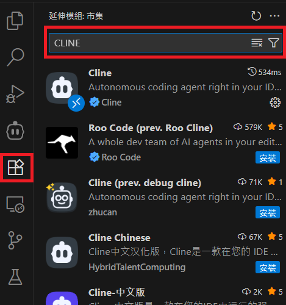
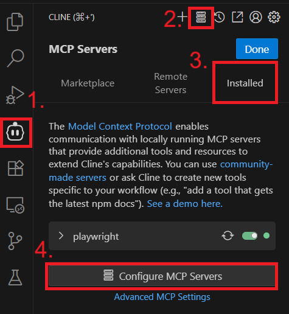
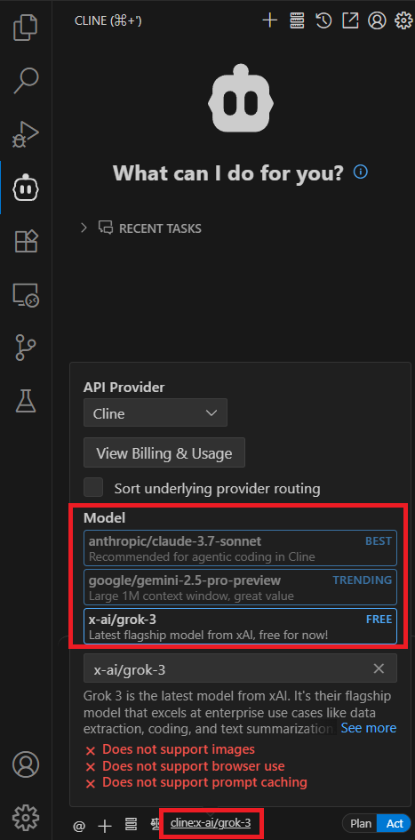
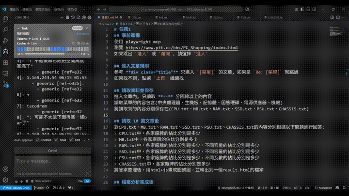
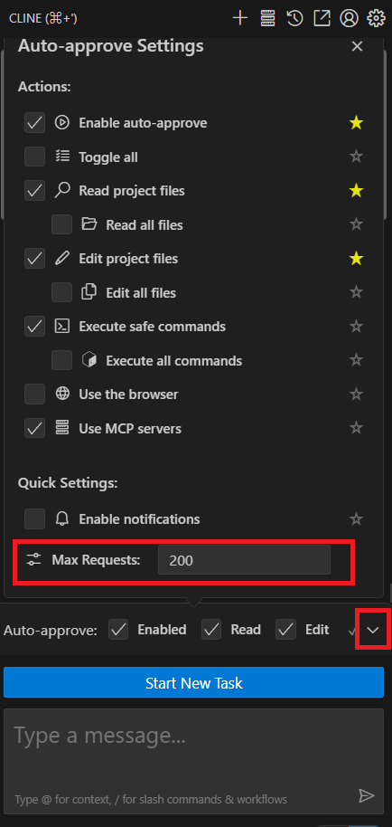

# playwright-mcp + CLINE + WSL 開發環境設定指南

本專案展示在WSL上建立一個完整的 VS Code + Playwright + CLINE 開發環境，並展示 MCP server 及 API provider 的設定。以下是一步步的安裝與設定流程。

node.js版的Playwright主要是給MCP sever使用，如果想要再寫一些功能性python腳本給AI使用，則使用新增虛擬環境中，python版的Playwright來執行

---

## 1. 安裝 [node.js](https://nodejs.org/zh-tw/download)

參考Node.js官網完成安裝，安裝後會自動包含 `npm` 和 `npx`：

```bash
# 下載並安裝 fnm：
curl -o- https://fnm.vercel.app/install | bash

# 下載並安裝 Node.js：
fnm install 24

# 檢查 Node.js & npm 版本：
node -v
npm -v
```

---

## 2. 安裝 [Playwright](https://playwright.dev/docs/intro#installing-playwright)
安裝過程中，如果有想使用Typescript可以自行選擇
安裝過程中，會有選項會問要不要執行`playwright install(manual)`，選擇手動
其他選項預設即可
```bash
npm init playwright@latest
```

### 2-1. 安裝 Chrome & Chromium

```bash
npx playwright install chrome    # 因為是WSL才需要
npx playwright install chromium
```

---

## 3. 安裝 [Visual Studio Code](https://learn.microsoft.com/zh-tw/windows/wsl/tutorials/wsl-vscode)
在專案路徑底下，執行`code`,會自動下載安裝 VS Code
: (如果有安裝過cursor可能會被干擾，需要調整PATH環境變數)
```bash
code .
```
---

## 4. 安裝 VS Code 擴充套件
在 VS Code 擴充套件商店搜尋並安裝 `CLINE` 插件
: 有需要可以順便安裝 `Python` 插件




### 4-1. 設定 CLINE: MCP server
[microsoft/playwright-mcp](https://github.com/microsoft/playwright-mcp)
在 CLINE的MCP server中加入以下設定：
```json
"mcpServers": {
  "playwright": {
    "command": "npx",
    "args": ["@playwright/mcp@latest"],
    "autoApprove": [
      "browser_click",
      "browser_close",
      "browser_install",
      "browser_navigate",
      "browser_navigate_back"
    ]
  }
}
```




### 4-2. （可選）設定 CLINE: API Provider

在 CLINE 介面中選擇想要的 API Provider



---

## 5. （可選）建立 Python 虛擬環境：`playwright-env`

```bash
python -m venv playwright-env
source playwright-env/bin/activate
pip install pytest-playwright
playwright install chromium
```

---

## 6. 設定 VS Code Terminal Profile

在 `.vscode/settings.json` 中加入以下內容：
: 注意: 設定錯誤可能導致AI Agnet <font color="#f00">讀不到Terminal的內容</font>
: (目前CLINE<font color="#f00">只支援zsh、bash、fish</font>)

```json
{
    "python.defaultInterpreterPath": "./playwright-env/bin/python3",
    "terminal.integrated.defaultProfile.linux": "WSL",
    "terminal.integrated.profiles.linux": {
        "WSL": {
            "path": "/bin/bash",
        }
    }
}
```

---

## ✅ 環境完成，建立任務內容
可以在 VS Code 中，`.clinerules`資料夾底下，使用`markdown`檔案來描述任務內容，再CLINE介面讓AI 助理執行任務，實現以自然語言自動化執行完成所有操作。
: 參考 [**任務1**](./.clinerules/任務1.md)



### 確認所有工具及環境運作正常後，可以自行調整CLINE: auto-approved上限跟允許的行為

